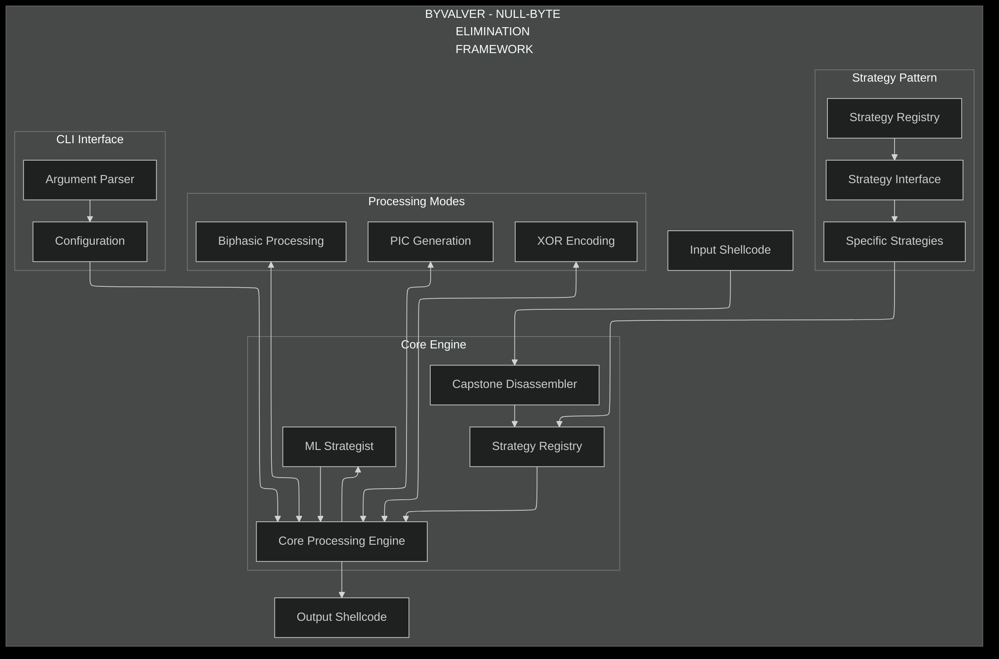
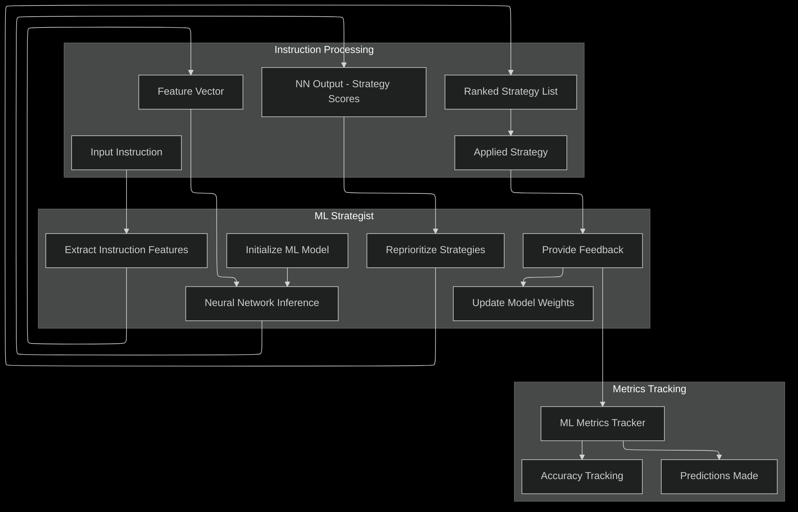

<div align="center">
  <h1>byvalver</h1>
  <p><b>NULL-BYTE ELIMINATION FRAMEWORK</b></p>

  
</div>

<div align="center">

  
  &nbsp;
  
  &nbsp;
  
  &nbsp;
  

</div>

<p align="center">
  <a href="#overview">Overview</a> •
  <a href="#features">Features</a> •
  <a href="#architecture">Architecture</a> •
  <a href="#building-and-setup">Building</a> •
  <a href="#installation">Installation</a> •
  <a href="#usage-guide">Usage</a> •
  <a href="#development">Development</a> •
  <a href="#troubleshooting">Troubleshooting</a>
</p>

<hr>

## OVERVIEW

**byvalver** is a C-based command-line tool designed for automated denulling (removal of null bytes) of shellcode while preserving functional equivalence. The tool leverages the Capstone disassembly framework to analyze x86/x64 assembly instructions and applies a library of ranked transformation strategies to replace null-containing instructions with functionally equivalent, denulled alternatives.

**Primary Function:** Remove null bytes (`\x00`) from binary shellcode that would otherwise cause issues with string-based operations or memory management routines.

**Technology Stack:**
- C language implementation for performance and low-level control
- Capstone Disassembly Framework for instruction analysis
- NASM assembler for building decoder stubs
- x86/x64 assembly and instruction set knowledge
- Modular strategy pattern for extensible transformations

`byvalver` prioritizes `security`, `robustness`, and `portability`, running seamlessly on Windows, Linux, and macOS.

## FEATURES

### Advanced Transformation Engine
BYVALVER includes 80+ instruction transformation strategies that handle complex instructions including arithmetic, MOV, conditional jumps, and API calls. The engine uses sophisticated instruction rewriting to eliminate null bytes while preserving functionality.

**Key Features:**
- **Strategy Registration**: Comprehensive registration system for all transformation strategies
- **Fallback Mechanisms**: Robust fallback systems when primary transformation methods fail
- **Complex Instruction Handling**: Advanced handling of instructions with null bytes in operands, displacements, and immediate values

### Batch Directory Processing
Process multiple shellcode files in batch mode with directory processing capabilities.

- `-r, --recursive`: Process directories recursively.
- `--pattern PATTERN`: File pattern to match (default: `*.bin`).
- `--no-preserve-structure`: Flatten output directory structure.
- `--no-continue-on-error`: Stop processing on the first error.

### ML-Powered Strategy Selection
Intelligently prioritizes transformation strategies based on instruction context using neural network inference.

- **Feature Extraction**: Extracts 128 features from each instruction.
- **Neural Network Inference**: A 3-layer feedforward network ranks strategies dynamically.
- **Prediction Tracking**: Tracks the ML model's prediction accuracy with real-time feedback.

### Comprehensive Verification Tools
A suite of Python-based tools to validate the output of byvalver.

- **`verify_denulled.py`**: Verifies that output files contain zero null bytes.
- **`verify_functionality.py`**: Verifies that processed shellcode maintains basic functional instruction patterns.
- **`verify_semantic.py`**: Verifies semantic equivalence between original and processed shellcode, accounting for expected transformations.

## ARCHITECTURE

BYVALVER follows a modular architecture based on the Strategy pattern, with components designed for extensibility and maintainability.

<div align="center">
  
  
</div>

## BUILDING AND SETUP

### Dependencies

- A C compiler (`gcc`, `clang`, or MSVC)
- [Capstone disassembly library](http://www.capstone-engine.org/) with development headers
- NASM assembler (`nasm`)
- `xxd` utility (usually part of `vim-common` package)
- Make

### Installation of Dependencies

```bash
# Ubuntu/Debian
sudo apt install build-essential nasm xxd pkg-config libcapstone-dev

# macOS with Homebrew
brew install capstone nasm
```

### Building from Source

The project uses a standard `Makefile`.

```bash
# Build the main executable (default)
make

# Build with debug symbols and sanitizers
make debug

# Build optimized release version
make release

# Build static executable
make static

# Clean build artifacts
make clean
```

## INSTALLATION

### 1. From Source
After building the project, you can install byvalver globally using the Makefile.

```bash
# Install the binary to /usr/local/bin and the man page
sudo make install
```

### 2. Using the Install Script
You can also use the provided shell script to install the latest release from GitHub or build from local sources.

```bash
# Download and run the script
curl -sSL https://raw.githubusercontent.com/mrnob0dy666/byvalver/main/install.sh | bash

# Or, to install from your local source clone:
chmod +x install.sh
./install.sh
```

## USAGE GUIDE

### Basic Syntax
```bash
byvalver [OPTIONS] <input_file> [output_file]
```
- `input_file`: Path to the input binary file containing shellcode.
- `output_file`: Optional. Path to the output binary file. Defaults to `output.bin`.

### Command-Line Options

- `-h, --help`: Show help message.
- `-v, --version`: Show version information.
- `-V, --verbose`: Enable verbose output.
- `-q, --quiet`: Suppress non-essential output.
- `--biphasic`: Enable biphasic processing (obfuscation + null-byte elimination).
- `--pic`: Generate position-independent code.
- `--ml`: Enable ML-powered strategy prioritization.
- `--xor-encode KEY`: XOR encode output with a 4-byte hex key (e.g., 0xDEADBEEF).
- `--format FORMAT`: Set output format (`raw`, `c`, `python`, `hexstring`).
- `-r, --recursive`: Process directories recursively.
- `--pattern PATTERN`: File pattern to match for batch processing.

### Processing Modes

1.  **Standard Mode**: Basic null-byte elimination.
    ```bash
    byvalver input.bin output.bin
    ```
2.  **Biphasic Mode**: Obfuscates the shellcode then eliminates null bytes.
    ```bash
    byvalver --biphasic input.bin output.bin
    ```
3.  **PIC Mode**: Generates position-independent code.
    ```bash
    byvalver --pic input.bin output.bin
    ```
4.  **XOR Encoding Mode**: Adds a decoder stub and XOR-encodes the output.
    ```bash
    byvalver --xor-encode 0xDEADBEEF input.bin output.bin
    ```

## DEVELOPMENT

### Code Style
The project follows modern C conventions with a focus on modularity and clarity.

### Testing
The project includes a Python-based test suite. To run the tests, execute the main test script:
```bash
python3 test_all_bins.py
```

## TROUBLESHOOTING
For issues with null-byte elimination, ensure your input file format is correct and verify that your system has the required dependencies installed. Check that the shellcode doesn't contain instructions that are particularly difficult to transform without null bytes.
